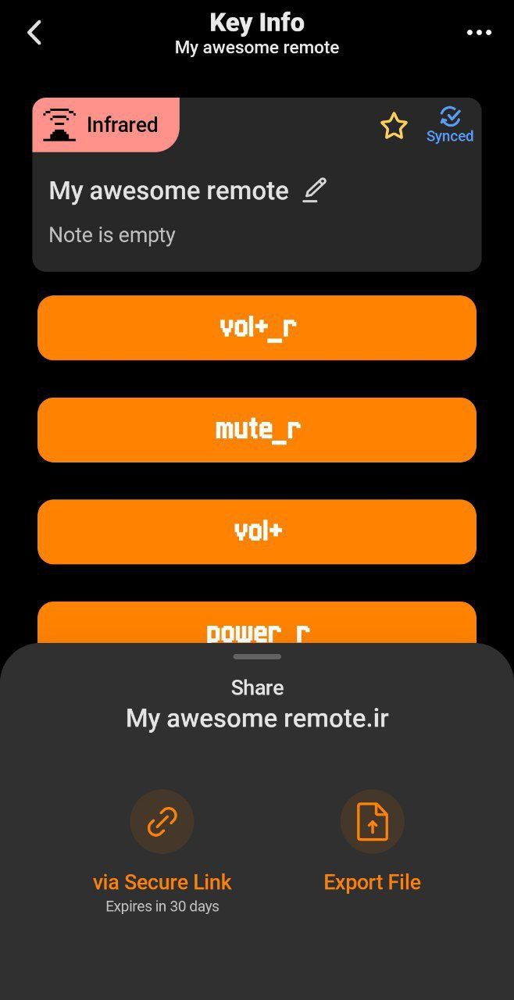

### Requirements

To add remote you will need two things:

- Flipper Zero
- Understanding of json format

### Creating IR file

Let's imagine, you want to add new file.

Firstly, you'll need to create `Infrared Remote` with your `Flipper` tool.

Next, you'll need to download this remote via link or export



### Creating configurations

Configuration are required to handle device key mapping.
You can see this links to see more about [avaliaable buttons](./avaliable_buttons.md)
or [button aliases](./button_names.md).

Let's create our configuration by example.

We have `Dell_p7524qt.ir` file, which contains some set of ir keys.

```
Filetype: IR signals file
Version: 1
# 
name: Power
type: parsed
protocol: NEC
address: 42 00 00 00
command: 01 00 00 00
# 
name: Ok
type: parsed
protocol: NEC
address: 42 00 00 00
command: 0D 00 00 00
# 
name: Menu
type: parsed
protocol: NEC
address: 42 00 00 00
command: 54 00 00 00
# 
name: Back
type: parsed
protocol: NEC
address: 42 00 00 00
command: 6D 00 00 00
```

The names of keys seems like understandable, but we need to map it into
our [avaliaable buttons](./avaliable_buttons.md).

So let's create `config.json` by reference on [button aliases](./button_names.md).

```json
{
  "key_map": {
    "PWR": {
      "type": "NAME",
      "key_name": "Power"
    },
    "OK": {
      "type": "NAME",
      "key_name": "Ok"
    },
    "MENU": {
      "type": "NAME",
      "key_name": "Menu"
    },
    "EXIT": {
      "type": "NAME",
      "key_name": "Back"
    }
  }
}
```

In this `config.json` we mapped our set of keys:

- `PWR` -> "Power"
- `OK` -> "Ok"
- `MENU` -> "Menu"
- `EXIT` -> "Back"

And now we are ready to create **Pull Request**

### Creating PullRequest

Clone the repository using git clone command

```bash
git clone https://github.com/flipperdevices/IRDB.git
```

Open `/database/categories` and lookup for your device category - TV, DVD etc.

In each category there's dozens of brands. Lookup for you brand provider - Samsung, Xiamoi etc.

Current path should be, for example, `/database/categories/TVs/Samsung` if your device is `TV` and brand is `Samsung`.

Next, you'll need to know the model of your device.
Let's imagine it `Samsung UE48JU6670`.
You see there's no yet the model like that. So you need to create a new folder *without
spaces* `/database/categories/TVs/Samsung/Samsung_UE48JU6670`.

If there's already device model like that - you can modify `.ir` file and `config.json`. Or create entire new folder(not
recommended) with custom postfix `_2`.

Now you need to move your downloaded `.ir` file and `config.json`:

- `/database/categories/TVs/Samsung/Samsung_UE48JU6670/Samsung_UE48JU6670.ir`
- `/database/categories/TVs/Samsung/Samsung_UE48JU6670/config.json`

Next, create new branch, push your changes and [create Pull Request](https://github.com/flipperdevices/IRDB/compare)
just [like here](https://github.com/flipperdevices/IRDB/pull/7)

Finally, see the green CI and wait for us to reply and merge!
